# Readarr diagrams

Architecture and behaviour of this Grok rewrite of Readarr (`.NET 10`, default metadata [rreading-glasses](https://github.com/blampe/rreading-glasses)). Labels match the English UI and `NzbDrone.*` types.

Operator procedures: [`docs/user-guide/index.html`](docs/user-guide/index.html).

## System context

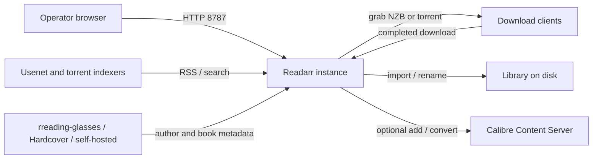

## Runtime architecture

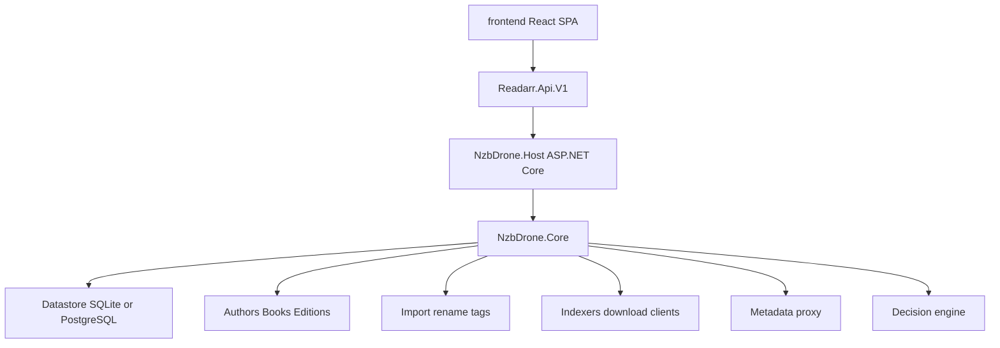

## Docker image

```mermaid
flowchart LR
    subgraph build [docker build]
        Node[node:20 webpack UI]
        SDK[dotnet/sdk:10.0 linux-x64]
        Node --> SDK
    end
    subgraph runtime [dotnet/aspnet:10.0]
        Apt[curl tzdata ca-certificates libsqlite3-0]
        App[/app Readarr.dll]
        Apt --> App
    end
    SDK -->|publish| runtime
    Cfg["/config"] --> App
```

`libsqlite3-0` is required because `System.Data.SQLite.Core.Servarr` loads `libsqlite3.so.0`.

## Domain model

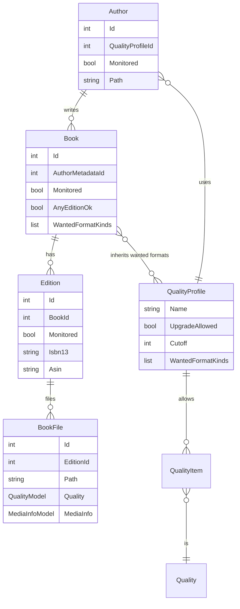

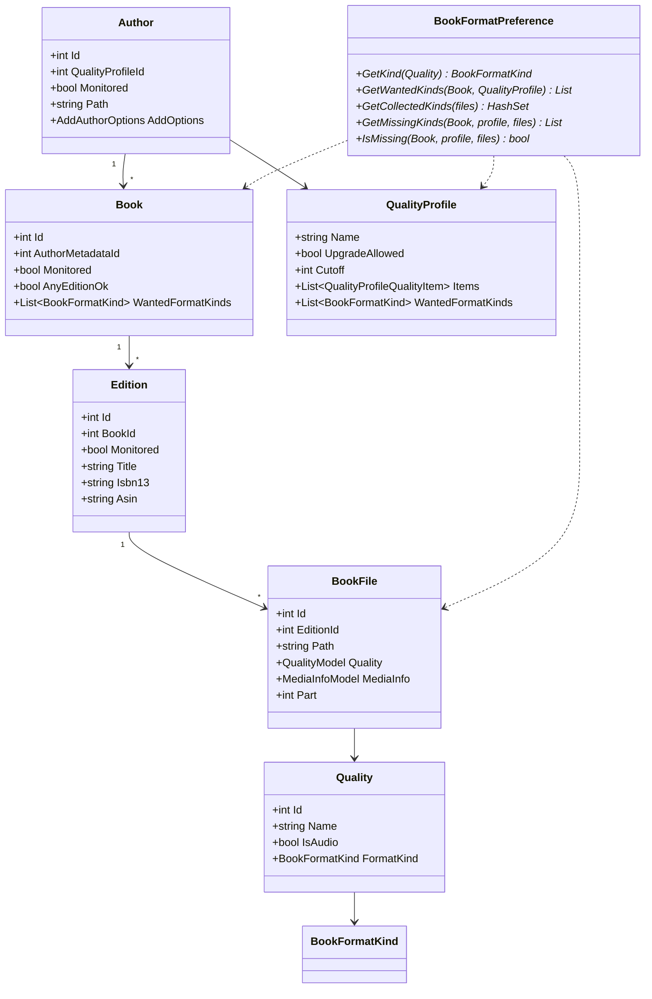

## Format kinds

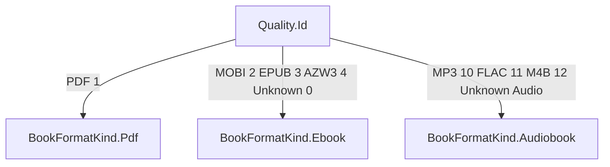

An EPUB does not satisfy PDF or audiobook. Upgrades stay inside one kind (MOBI → EPUB → AZW3, or MP3 → M4B → FLAC).

## Wanted formats: who decides

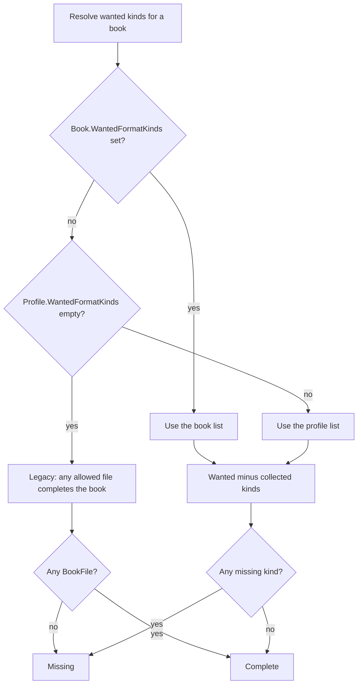

UI: **Settings → Profiles → Wanted Formats** (`Ebooks (EPUB, AZW3, MOBI)`, `PDFs`, `Audiobooks`). Per book: **Override wanted formats for this book**.

## RSS / search grab

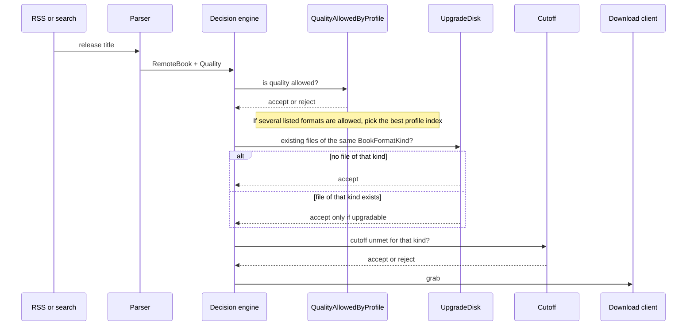

## Import and upgrade on disk

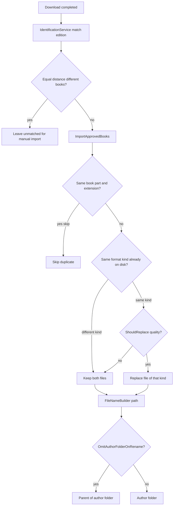

## Missing wanted formats

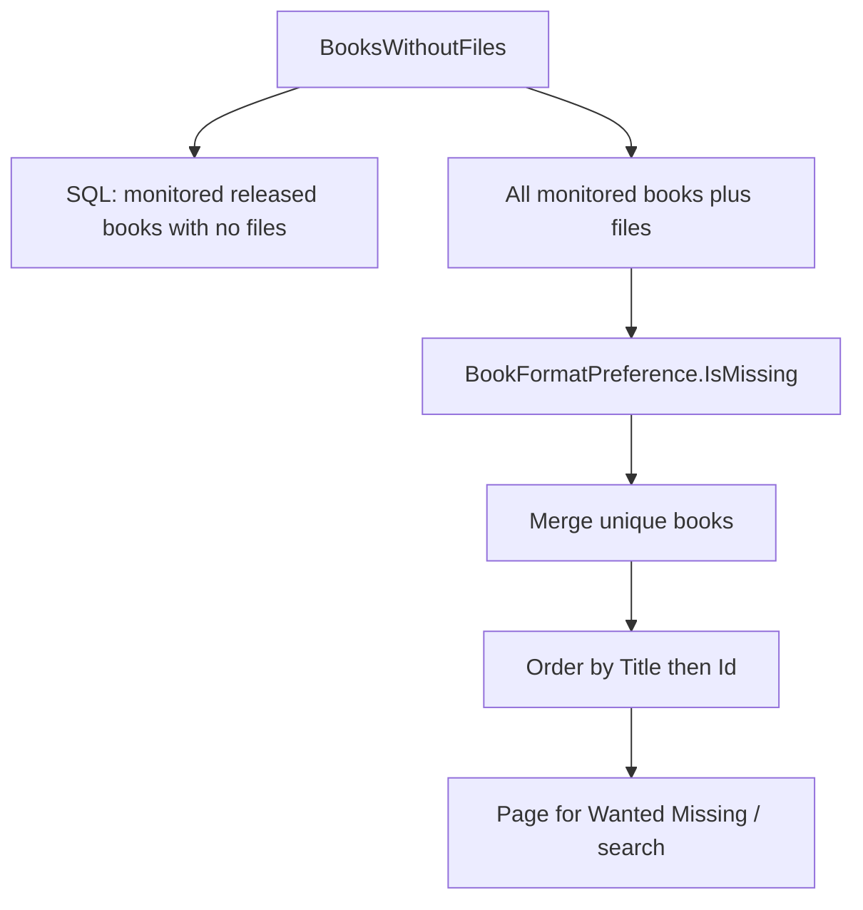

## Add author

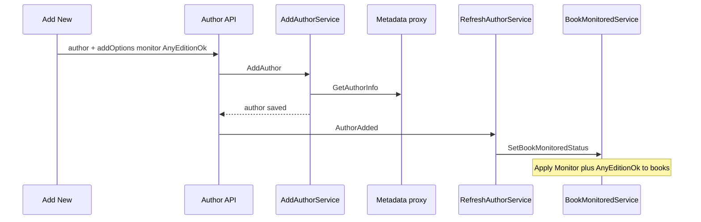

## Change monitored edition

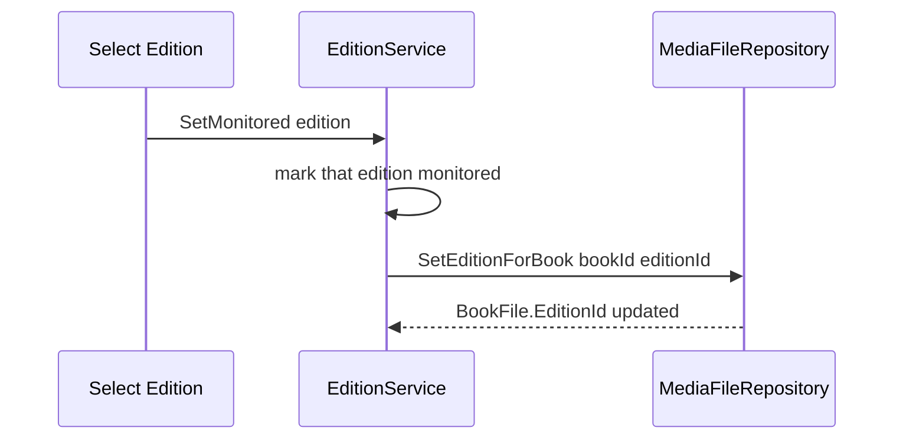

## Naming tokens

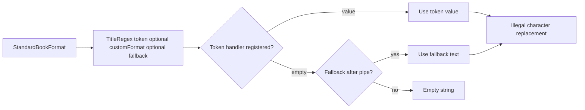

Examples from the naming picker: `{Book Series|Standalone}`, `{Book TitleNoEdition}`, `{Book SeriesPosition:00}`, `{Isbn}`, `{Asin}`, `{Narrator}`.

## Unmapped files: Map Selected

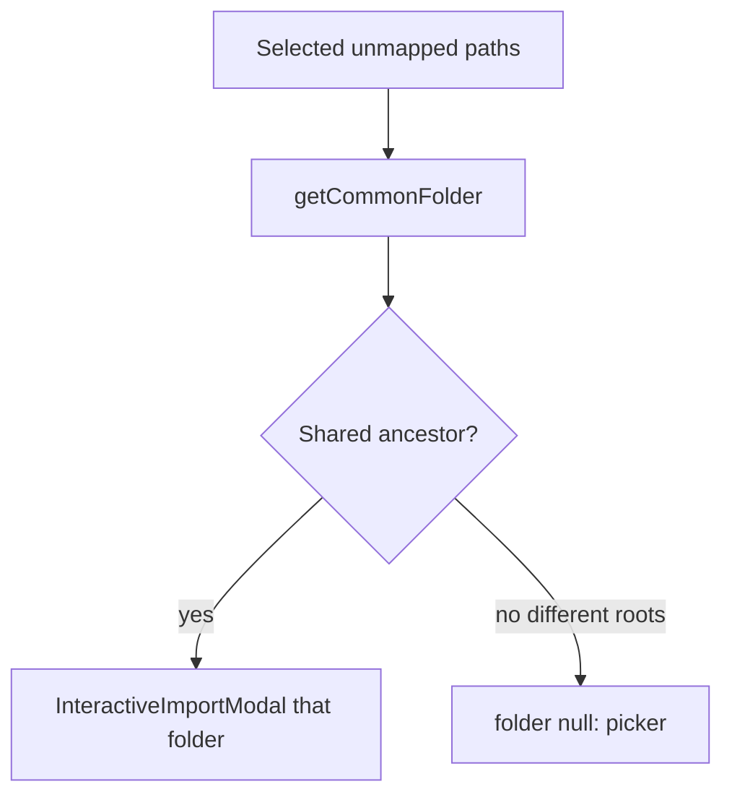

## First-run authentication

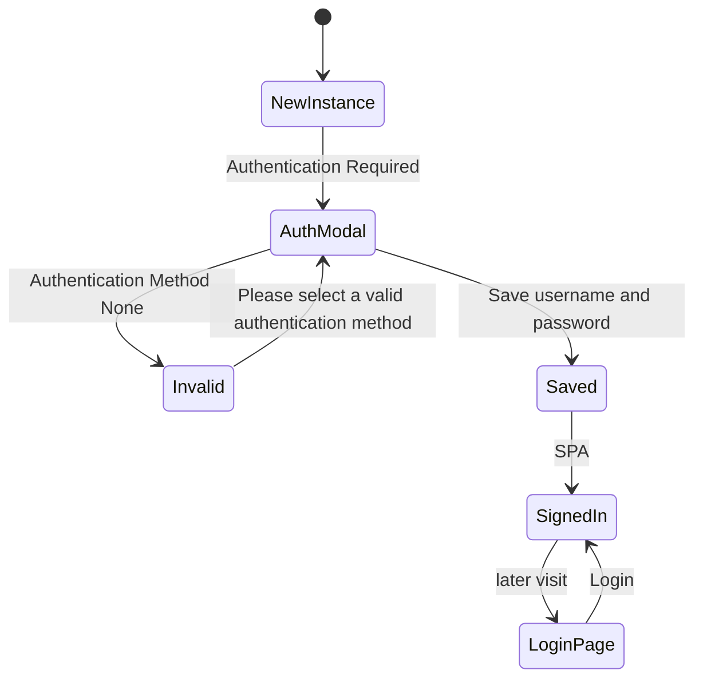

The login page heading is **SIGN IN TO CONTINUE**. Fields: **Username**, **Password**, **Remember Me**, **Login**.

## CI and image publish

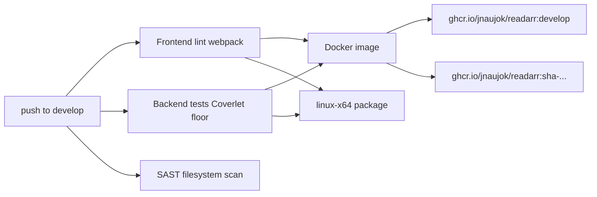

Coverlet: new slices locally ≥ 80%. CI fails only if merged whole-tree coverage is below `COVERAGE_FLOOR` (40%).
