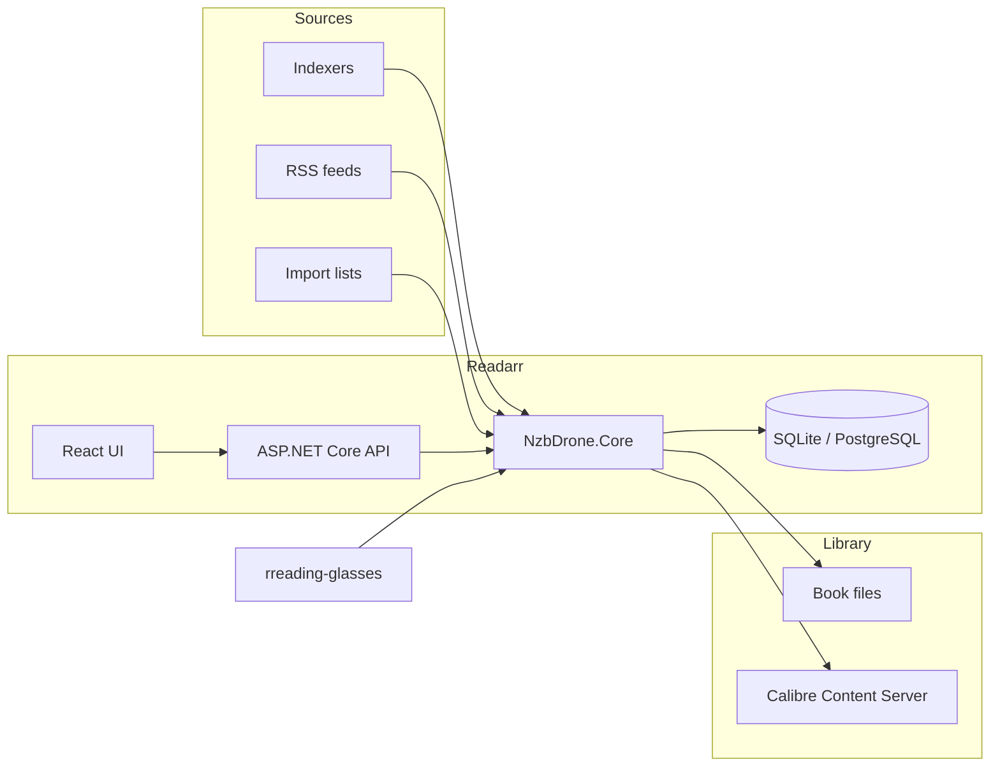
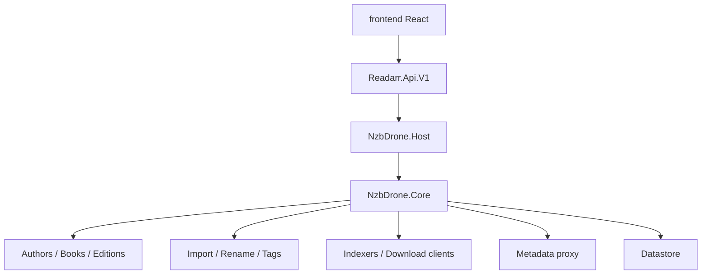

# Readarr

[](https://github.com/jnaujok/Readarr/actions/workflows/ci.yml)
[](https://dotnet.microsoft.com/download)
[](http://www.gnu.org/licenses/gpl.html)

This repository is a **major rewrite of [Readarr](https://github.com/Readarr/Readarr)** using [Grok](https://x.ai). The original Servarr project was retired after its metadata pipeline became unusable. This fork keeps the Readarr product model — ebook and audiobook collection management for Usenet and BitTorrent — and rebuilds it to run on **.NET 10**, with the bugs and naming gaps that accumulated while the upstream project was frozen.

It is still Readarr: authors, books, editions, quality profiles, download clients, and Calibre. It is not a new metadata product and not an Open Library / Hardcover rewrite. The default metadata provider is [rreading-glasses](https://github.com/blampe/rreading-glasses) at `https://api.bookinfo.pro`. Override that under **Settings → Development**, or point at a self-hosted instance or Hardcover (`https://hardcover.bookinfo.pro`).



## What this rewrite changes

- Targets **.NET 10 LTS** instead of the retired Servarr runtime.
- Defaults metadata to **rreading-glasses** (`https://api.bookinfo.pro`) instead of the dead upstream metadata service.
- Closes a large set of upstream stability bugs (queue handling, import/upgrade, Calibre null paths, extra-file matching, search/query, edition selection).
- Adds long-requested naming and library features: token fallbacks `{Token|fallback}`, `{Book TitleNoEdition}`, padded `{Book SeriesPosition:00}`, `{Isbn}` / `{Asin}` / `{Narrator}`, omit-author-folder on rename, edition sync onto book files, optional automatic edition switching on add, author-monitored book filters, and bulk map of unmapped files.

The original Servarr retirement notice still applies to [Readarr/Readarr](https://github.com/Readarr/Readarr). This fork is the continuation.

## Features

Readarr watches RSS feeds for books from authors you follow, then grabs, sorts, and renames them. Quality profiles can collect ebooks, PDFs, and audiobooks as independent copies of the same title, with a per-book override.

- Automatic quality upgrades (for example PDF → AZW3)
- Windows, Linux, macOS, and Raspberry Pi
- Library scan for missing books
- Failed-download handling with automatic retry of another release
- Manual search so you can pick a release or see why one was skipped
- Quality profiles and custom formats
- Configurable renaming, including fallback tokens and ISBN/ASIN/narrator
- SABnzbd, NZBGet, qBittorrent, Deluge, rTorrent, Transmission, uTorrent, and other download clients
- Calibre Content Server integration (library add and conversion)
- React UI

## Quick start

### Prerequisites

- [.NET SDK 10](https://dotnet.microsoft.com/download)
- Node.js (for the UI)
- SQLite (default) or PostgreSQL

### Build and run

```bash
export PATH="$HOME/.dotnet:$PATH"
dotnet build src/Readarr.sln -c Release
dotnet test src/NzbDrone.Core.Test/NzbDrone.Core.Test.csproj -c Release --filter "FullyQualifiedName!~Integration"
```

The default branch is `develop`.

### Metadata

Default: `https://api.bookinfo.pro` (rreading-glasses, no `/v1` suffix).

Set a different provider under **Settings → Development**, or host your own [rreading-glasses](https://github.com/blampe/rreading-glasses) instance.

## Architecture



House style matches the original *arr stack: `NzbDrone.*` namespaces, NUnit, FluentAssertions, Moq, Newtonsoft.Json, DryIoc, and StyleCop. New work stays in that dialect.

## Development

- Solution: `src/Readarr.sln`
- Unit tests: `src/NzbDrone.Core.Test`
- API: `src/Readarr.Api.V1`
- UI: `frontend/`
- Coverage gate for new slices: Coverlet ≥ 80%

See [CONTRIBUTING.md](CONTRIBUTING.md) for the original contribution notes.

## Lineage

Readarr was created by the Servarr team as an ebook/audiobook companion to Sonarr, Radarr, and Lidarr. Upstream development stopped when the metadata service failed and the Open Library migration stalled. This Grok-assisted rewrite keeps that product, modernizes the runtime, and continues bug and feature work against the archived [Readarr/Readarr](https://github.com/Readarr/Readarr) issue list.

Thanks to every Servarr contributor who built the original application.

### License

- [GNU GPL v3](http://www.gnu.org/licenses/gpl.html)
- Copyright 2010-2026
